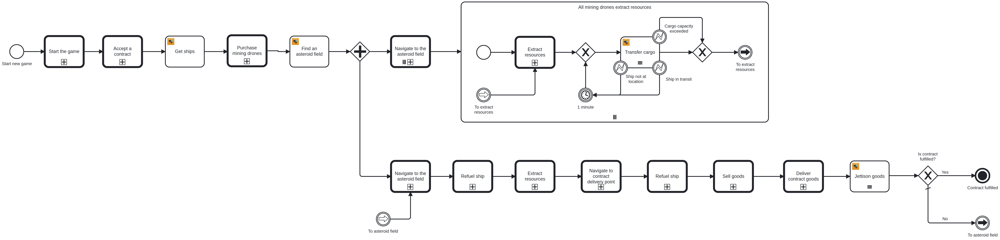

# Mining process

This process automates the mining process. It contains the following steps:
- Create a new agent
- Accept the first contract
- Purchase as many mining drones as possible
- Navigate the mining drones and the command ship to the engineered asteroid
- Extract resources with the mining drones and the command ship
- Transfer the resources to the command ship
- The command ship navigates to the contract delivery point
- The command ship sells the resources and delivers the contract goods

## Usage

1. Deploy the [process blocks](https://github.com/camunda-community-hub/camunda-space-traders/tree/main/process-blocks)
2. Deploy all processes from this folder
3. Start the process by using the form 
